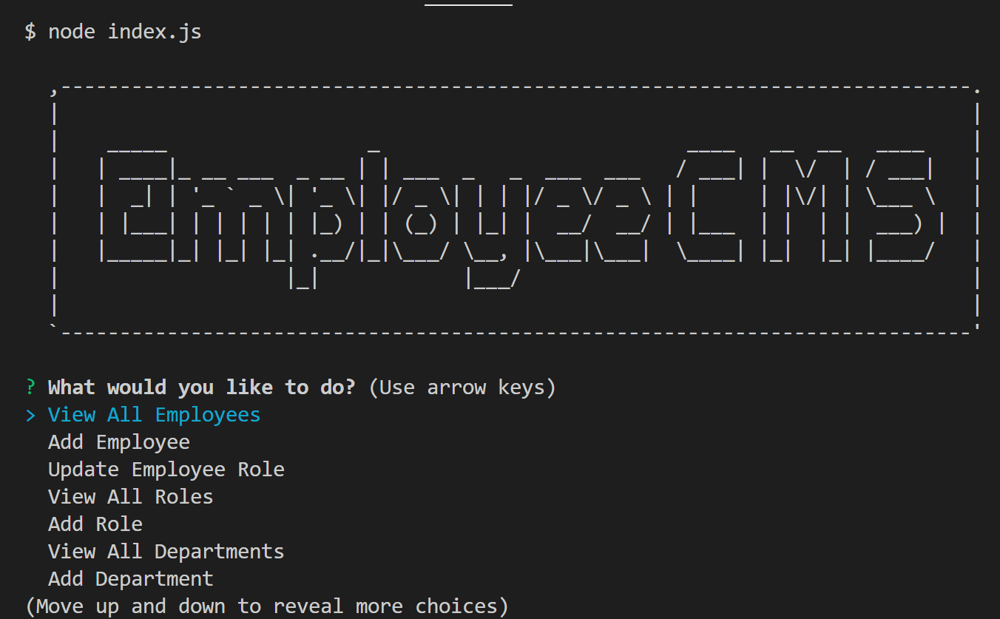

# Employee CMS

## Description

This content management system (CMS) is used in the console. It allows employers to track their employees' roles, salaries, departments, and supervisors.

This project is meant to help business owners more easily manage their business. 

## Installation

Simply type "node index.js" into the console to start the application and you will be presented with quesitons to navigate the application.

## Usage

You can toggle through the questions with your up and down arrow keys to select the option you would like, then press Enter. If you are adding information to the CMS it will ask you more questions for input. If you are simply requesting information it will print to the console. 

## Credits

I used past assignments to help with the code as well as my tutor. 

Video link to show navigation: https://app.castify.com/view/33aaf90a-b7f5-4897-b95f-64504a0dce59
